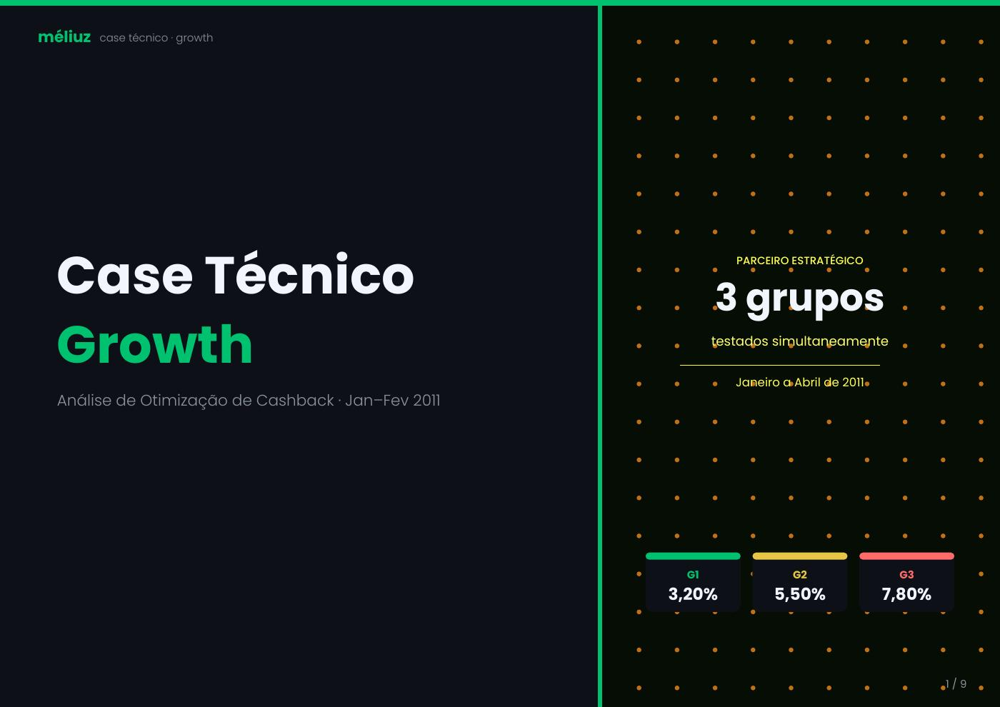

# Growth Experimentation — Cashback Optimization

## Problem

A partner tested three cashback levels simultaneously. The decision could not be based only on sales growth: the incentive also reduces unit economics.

## Objective

Identify the cashback level that best balances customer response and profitability.

## Design

Three groups were analyzed with cashback levels of **3.2%, 5.5% and 7.8%**.

## Method

- comparison of sales/customer outcomes across groups;
- commission and net-margin analysis;
- incremental uplift vs. the control/reference group;
- break-even calculation;
- decision framing based on growth vs. economic sustainability.

## Result

The analysis showed that higher cashback increased purchasing response, but the economic cost grew faster. The recommendation favored the intermediate cashback level rather than maximizing the incentive.

## Evidence

[Open the case PDF](evidence/meliuz-growth-case.pdf)

## Skills demonstrated

Experimentation · Growth Analytics · Statistics · Unit Economics · Break-even Analysis · Decision Making
